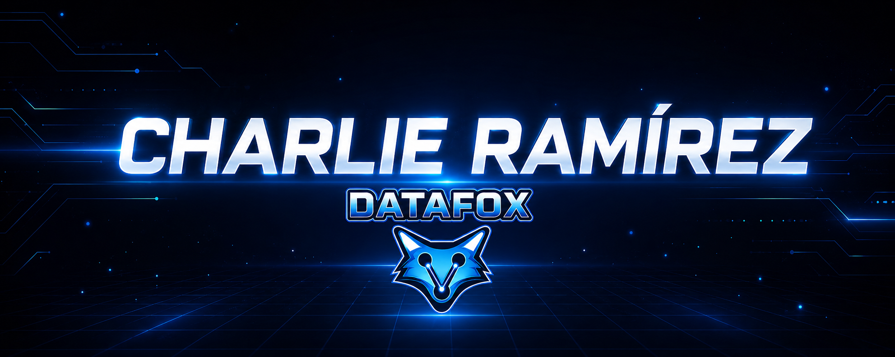

  

---

### 🙋‍♂️ Sobre mí

Soy **Charlie Ramírez**, estudiante de **Desarrollo de Software** y apasionado por la tecnología, el desarrollo web y el hardware.

Actualmente me estoy formando como **Técnico Vocacional en Desarrollo de Software**, mientras desarrollo proyectos que combinan software, bases de datos y automatización.

Me interesa especialmente crear soluciones que no solo funcionen, sino que también tengan una buena estructura, seguridad y una experiencia de usuario agradable.

🛠️ También cuento con experiencia en **reparación y mantenimiento de computadoras, laptops e impresoras**, lo que me ha permitido combinar mis conocimientos de hardware con el desarrollo de software.

🚀 Actualmente trabajo principalmente en proyectos web y en **Nexora**, una plataforma que integra tienda virtual, delivery, bases de datos y automatización mediante hardware.

🎯 Mi objetivo es seguir creciendo como desarrollador, fortalecer mis conocimientos de backend y bases de datos y continuar creando proyectos que integren **software + hardware**.

---

### 🧰 Lenguajes y Tecnologías

  

  
  
  
  

